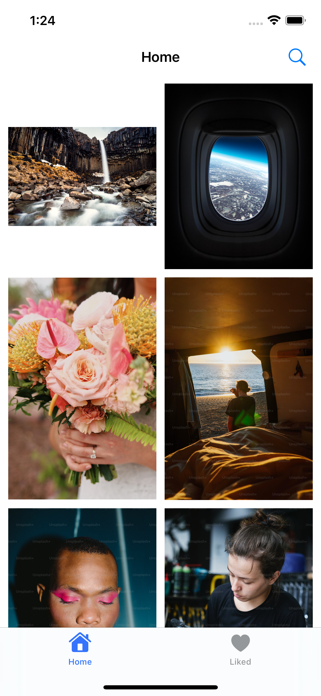
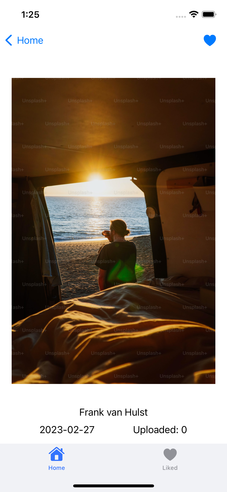
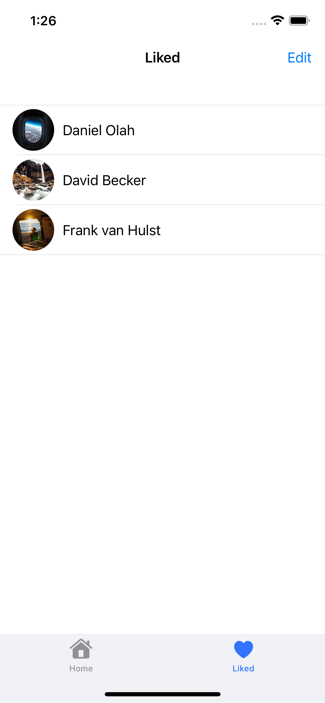

# UnsplashApp
---
На _первой вкладке_ — коллекция случайных фотографий с Unsplash. Вверху строка поиска по фотографиям с Unsplash. При нажатии на ячейку пользователь попадает на экран подробной информации.

На _второй вкладке_ — таблица со списком любимых фотографий,
в ячейке миниатюрка фотографии и имя автора. При нажатии на ячейку — переход в экран подробной информации.

Экран подробной информации содержит в себе фотографию, имя автора, дату создания и количество скачиваний.
Также экран содержит кнопку, нажатие на которую может добавить фотографию в список любимых фотографий и удалить из него.

Основные требования к заданию:
- Всю вёрстку приложения делайте кодом, без xib и storyboard
- Не используйте SnapKit, верстать нужно только через Auto Layout
- Не используйте SwiftUI
- Используйте как минимум одну стороннюю библиотеку Cocoa Pods (кроме Unsplash Photo Picker for iOS и прочие подобные для работы с Unsplash) 
- Должен быть как минимум один Алерт

Tech Stack: UIKit, Auto Layout, Alamofire, Realm, SDWebImage, UserDefaults.

----

